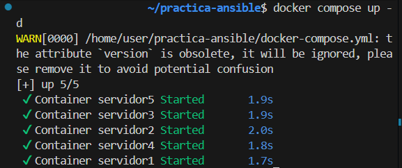
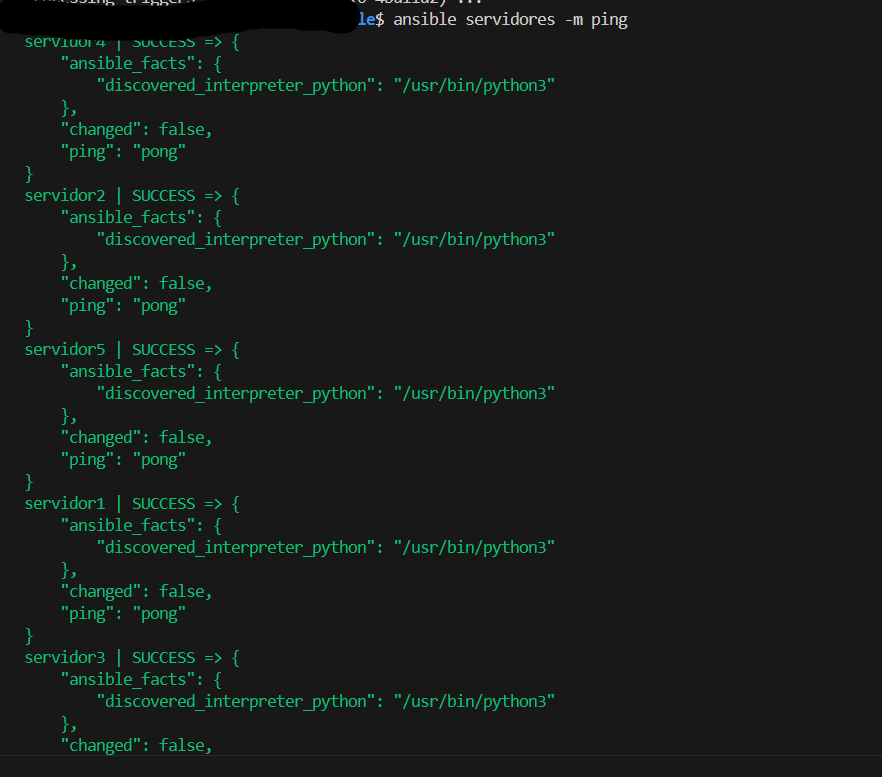
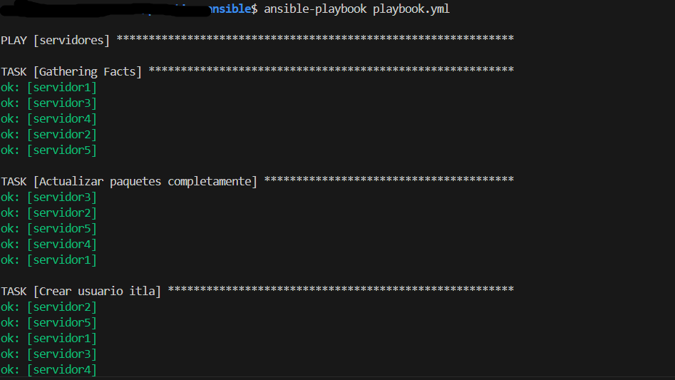
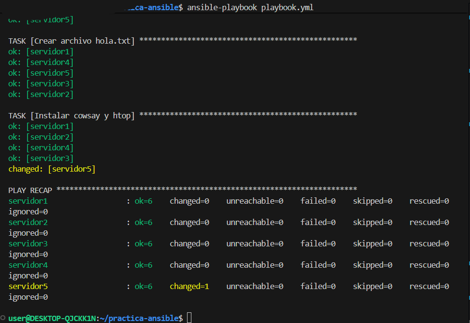

# 📦 Automatización con Ansible y Docker

## 📌 Descripción

En esta práctica se implementa un entorno automatizado utilizando **Docker** y **Ansible** para la configuración de múltiples servidores Ubuntu.

Se crean 5 servidores virtuales mediante contenedores Docker, y posteriormente se utiliza Ansible para automatizar tareas administrativas como instalación de paquetes, creación de usuarios y gestión de archivos.

---

## 🛠️ Tecnologías utilizadas

* Docker
* Docker Compose
* Ansible
* Ubuntu
* WSL (en caso de usar Windows)

---

## ⚙️ Paso 1: Crear imagen Docker (Dockerfile)

Se crea una imagen personalizada de Ubuntu con:

* SSH Server instalado
* Usuario `ansible`
* Permisos sudo sin contraseña

```dockerfile
FROM ubuntu:22.04

RUN apt update && apt install -y openssh-server sudo

RUN mkdir /var/run/sshd

RUN useradd -m ansible && echo "ansible:ansible" | chpasswd

RUN usermod -aG sudo ansible
RUN echo "ansible ALL=(ALL) NOPASSWD:ALL" >> /etc/sudoers

EXPOSE 22

CMD ["/usr/sbin/sshd", "-D"]
```

---

## ⚙️ Paso 2: Crear docker-compose.yml

Se crean 5 contenedores basados en la imagen anterior:

```yaml
version: '3'

services:
  servidor1:
    build: .
    container_name: servidor1
    ports:
      - "2221:22"

  servidor2:
    build: .
    container_name: servidor2
    ports:
      - "2222:22"

  servidor3:
    build: .
    container_name: servidor3
    ports:
      - "2223:22"

  servidor4:
    build: .
    container_name: servidor4
    ports:
      - "2224:22"

  servidor5:
    build: .
    container_name: servidor5
    ports:
      - "2225:22"
```

### ▶️ Levantar los contenedores

```bash
docker compose up -d
```

---

## ⚙️ Paso 3: Instalación de Ansible

### En Windows (usar WSL):

```bash
wsl --install
```

Luego dentro de Ubuntu:

```bash
sudo apt update
sudo apt install ansible -y
```

---

## ⚙️ Paso 4: Inventario y configuración

### 📄 inventario.ini

```ini
[servidores]
servidor1 ansible_host=127.0.0.1 ansible_port=2221 ansible_user=ansible ansible_password=ansible
servidor2 ansible_host=127.0.0.1 ansible_port=2222 ansible_user=ansible ansible_password=ansible
servidor3 ansible_host=127.0.0.1 ansible_port=2223 ansible_user=ansible ansible_password=ansible
servidor4 ansible_host=127.0.0.1 ansible_port=2224 ansible_user=ansible ansible_password=ansible
servidor5 ansible_host=127.0.0.1 ansible_port=2225 ansible_user=ansible ansible_password=ansible
```

### 📄 ansible.cfg

```ini
[defaults]
inventory = inventario.ini
host_key_checking = False
```

---

## ⚙️ Paso 5: Playbook de Ansible

### 📄 playbook.yml

```yaml
- name: Configuración de servidores
  hosts: servidores
  become: yes

  tasks:

    - name: Actualizar paquetes
      apt:
        update_cache: yes

    - name: Crear usuario itla
      user:
        name: itla
        state: present

    - name: Crear carpeta app
      file:
        path: /home/ansible/app
        state: directory

    - name: Crear archivo hola.txt
      copy:
        dest: /home/ansible/app/hola.txt
        content: "Hola mundo desde Ansible"

    - name: Instalar cowsay y htop
      apt:
        name:
          - cowsay
          - htop
        state: present
```

### ▶️ Ejecutar playbook

```bash
ansible-playbook playbook.yml
```

---

## 📸 Evidencias

Las imágenes utilizadas en este proyecto se encuentran en la carpeta `imagenes/` dentro del repositorio. Se enlazan directamente de forma relativa:

### Contenedores en ejecución



### Conexión SSH



### Ejecución de Ansible (1)



### Ejecución de Ansible (2)



---

## ✅ Resultados

Se logró:

* Automatizar la configuración de 5 servidores Ubuntu
* Crear usuarios y estructuras de archivos automáticamente
* Instalar aplicaciones en todos los servidores al mismo tiempo
* Reducir errores humanos mediante automatización

---

## 🎯 Conclusión

El uso de Docker junto con Ansible permite crear entornos reproducibles y automatizar tareas de administración de sistemas de manera eficiente. Esta práctica demuestra cómo escalar configuraciones en múltiples servidores de forma rápida y organizada.

---

## 👨‍💻 Autor

Keren Almonte Guilamo

Proyecto académico - Automatización con Ansible y Docker
